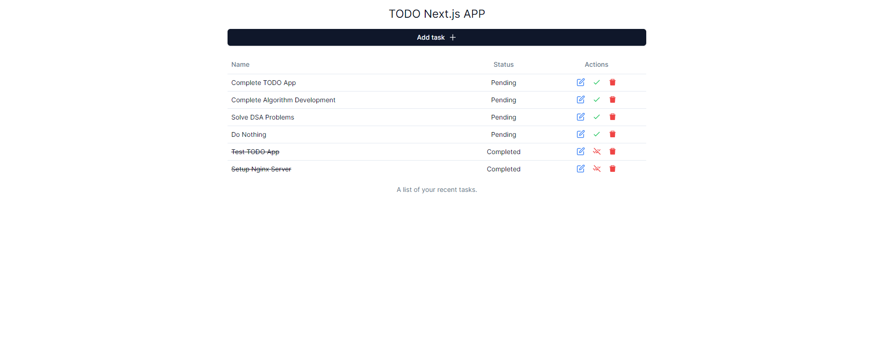
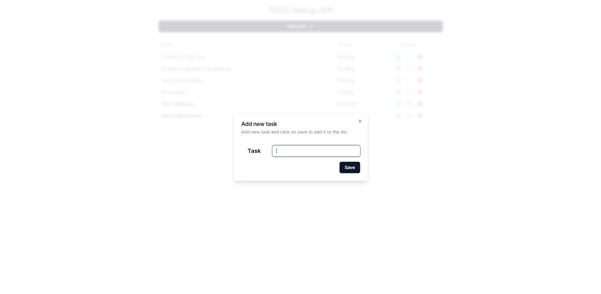
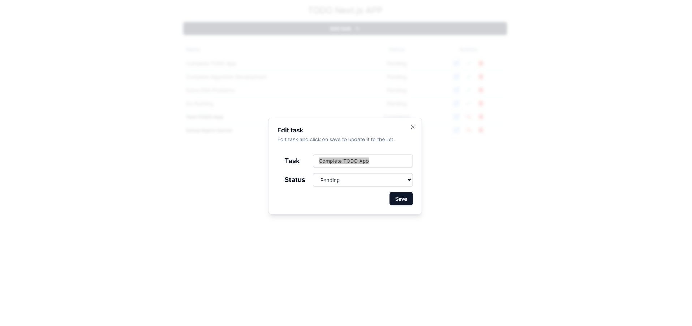

# Todo NextJS App

## Getting Started

- Clone the repo
- Run `npm install`
- Run `npm run dev`
- Open [http://localhost:3000](http://localhost:3000) with your browser to see the result.

## Features

- [x] Add a todo
- [x] Delete a todo
- [x] Mark a todo as completed
- [x] Update a todo

## Tech Stack

- NextJS
- ReactJS
- TailwindCSS
- Shadcn UI
- Json Server

## Screenshots

- 
- 
- 
